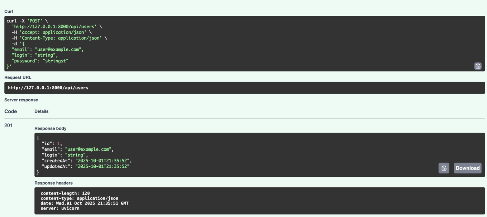
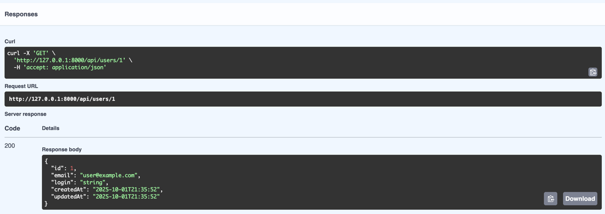
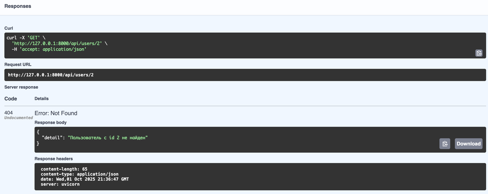
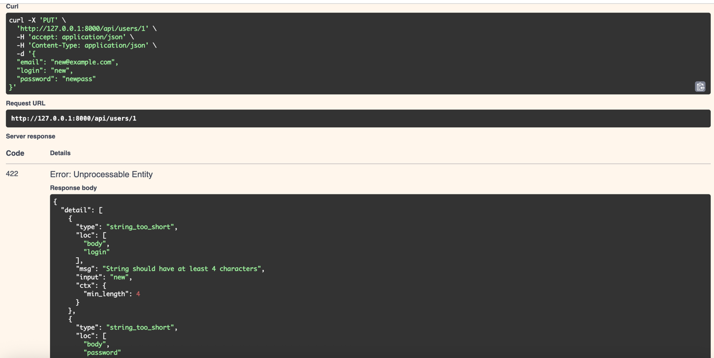
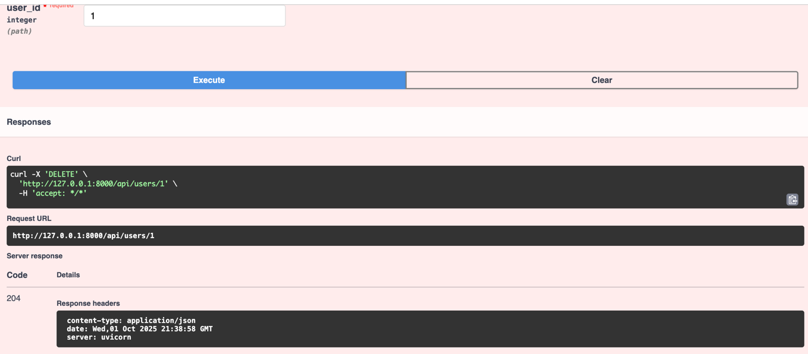
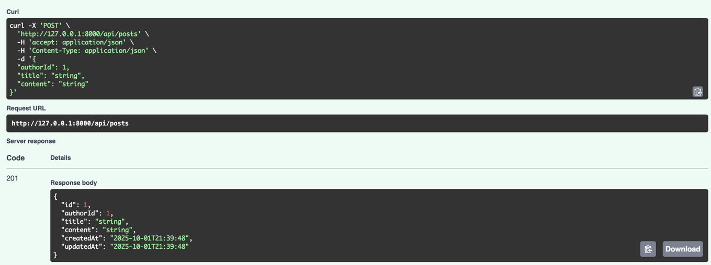
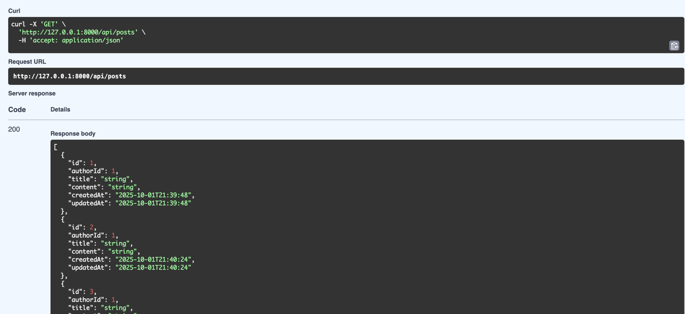
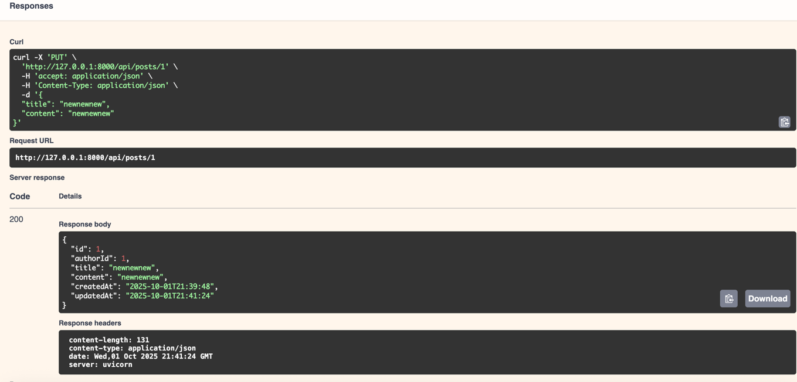
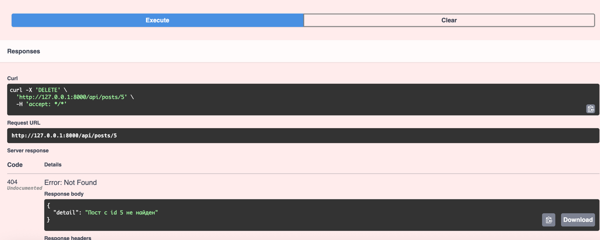

Реализованные критерии

**Бэкенд**

- [x] Хранение данных в БД - 1 балл
- [x] Использование инструмента для миграций - 1 балл
- [x] Контейнеризация - 1 балл
- [x] CRUD-операции для всех сущностей - 2 балла
- [x] Валидация входных данных и обработка ошибок - 1 балл
- [x] Авторизация и контроль доступа - 1 балл
- [x] Пагинация и фильтрация постов и пользователей - 1 балл
- [x] Использование кэширования - 1 балл
- [x] Ролевая система контроля доступа - 1 балл
- [x] Тестирование. Написаны unit и интеграционные тесты, тестовое покрытие больше 50% - 2 балла

Итого: 12 баллов 

**Фронтенд**

- [x] Регистрация, аутентификация и страницы регистрации и входа - 2 балла
- [x] Страница профиля пользователя с возможностью редактирования информации собственного аккаунта - 1 балл
- [x] Главная страница с лентой постов - 1 балл
- [x] Страница создания поста - 1 балл
- [x] Возможность поиска постов по заголовку и тексту - 1 балл
- [x] Возможность поиска пользователей - 1 балл
- [x] Возможность оставлять комментарии к посту - 1 балл
- [x] Возможность сохранять и просматривать избранные посты - 1 балл
- [x] Валидация данных форм - 1 балл
- [x] Обработка серверных ошибок - 1 балл
- [x] Написаны unit и компонентные тесты, тестовое покрытие 81%  2 балла

Итого: 13 баллов

Запуск проекта:

```bash
git clone https://github.com/mysthz/RestAPI-HW.git
```

```bash
cd RestAPI-HW
```

```bash
pip install poetry==2.2.1
poetry install
```

```bash
npm install
```

```bash
cd blog_system_frontend
cp .env.example .env
```

```bash
docker compose up -d --build
```

Установка хуков:
```bash
pre-commit install
```

Создание миграции
```bash
poetry run alembic revision --autogenerate -m "message"
```

Создание аккаунта админа с помощью cli
```bash
docker exec -it blog-system-backend-1 sh

poetry run cli admin create \
    --login "admin" \
    --email "admin@admin.com" \
    --password "admin123"
```

Тестирование

Unit-тесты

```bash
poetry run pytest blog_system_backend/tests/unit/ --cov=blog_system_backend/src/api
```

Покрытие: 65%

Integration-тесты

```bash
poetry run pytest blog_system_backend/tests/integration/ --cov=blog_system_backend/src/api
```

Покрытие: 69%

Unit-тесты фронтенд
```bash
npm run test:coverage
```


Swagger












ER-диаграмма:


